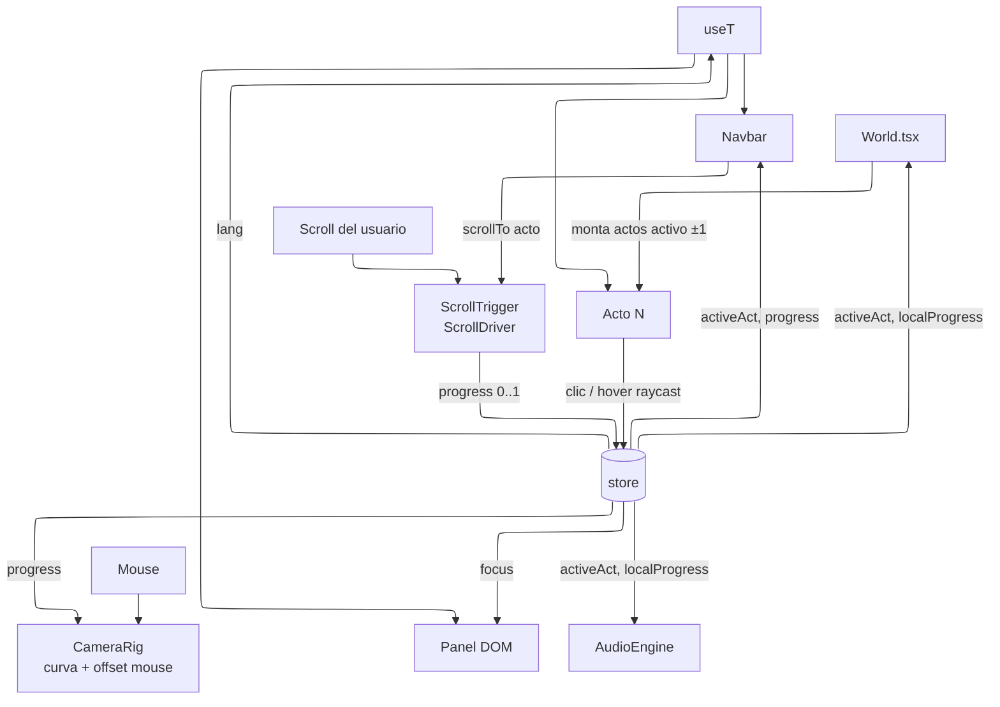

# Arquitectura — Portafolio 3D

> Complemento técnico de [`plan.md`](./plan.md) (guion narrativo). Aquí se define **cómo** se construye; allá, **qué** se cuenta en cada acto.
> El prototipo anterior en `.temp/` (glassmorphism por secciones) queda superado; solo se reutiliza su stack y configuración pues era horrible en su paleta de colores y no tenía identidad. Es importante definir esta paleta para poder cambiar los colores, para empezar con tonos de blanco y negro (quizás gris) que permita contrastar bien.

**Los 5 actos** (ver `plan.md` → "Resumen en 5 líneas"):

| #   | Acto                   | Contenido                         | Colección    |
| --- | ---------------------- | --------------------------------- | ------------ |
| 1   | Galaxia                | Título y rol                      | `site`       |
| 2   | Espacio de soluciones  | Sobre mí                          | `bio`        |
| 3   | Muelle y mar           | Trayectoria (medusas)             | `milestones` |
| 4   | El faro                | Piano → partitura con el stack    | `skills`     |
| 5   | Dentro del piano       | Proyectos (ciudad) + buzón        | `projects`, `posts`, `site` |

---

## 1. Objetivo y principios

1. **Una sola página, un scroll continuo.** No hay rutas por sección; el scroll es la línea de tiempo de la narrativa.
2. **Un solo `<Canvas>` persistente.** Los cinco actos viven en la misma escena de Three.js; se montan y desmontan por proximidad, nunca se recrea el contexto WebGL.
3. **Contenido como datos.** Ninguna escena tiene texto o proyectos hardcodeados: todo sale de colecciones (`bio`, `milestones`, `skills`, `projects`, `posts`). Añadir un hito = añadir un archivo, y aparece una medusa más.
4. **i18n desde el día 1.** Todo texto visible pasa por la capa de traducción, también el que está dentro del canvas.
5. **Progressive enhancement.** Astro genera todo el contenido como HTML semántico (SEO, lectores de pantalla, fallback sin WebGL). El mundo 3D es una capa encima, no la única forma de acceder a la información.

---

## 2. Stack

| Paquete                             | Versión  | Rol                                                                         |
| ----------------------------------- | -------- | --------------------------------------------------------------------------- |
| `astro`                             | ^5.16.5  | Build estático, Content Collections, HTML semántico                         |
| `@astrojs/react`                    | ^4.4.2   | Isla React para el mundo 3D                                                 |
| `react` / `react-dom`               | ^19.2.3  | UI del overlay y árbol de R3F                                               |
| `three`                             | ^0.182.0 | Motor 3D                                                                    |
| `@react-three/fiber`                | ^9.4.2   | Three.js declarativo en React                                               |
| `@react-three/drei`                 | ^10.7.7  | Helpers: `Text`, `useGLTF`, `useKTX2`, `useDetectGPU`, `PerformanceMonitor` |
| `gsap`                              | ^3.14.2  | `ScrollTrigger` → progreso de scroll; `ScrollToPlugin` para la navbar       |
| `tailwindcss` + `@tailwindcss/vite` | ^4.1.18  | Estilos del overlay y del fallback HTML                                     |
| `@types/react` / `@types/react-dom` | ^19.2.x  | Tipos                                                                       |

**Adiciones mínimas (justificadas):**

| Paquete                       | Por qué                                                                                                       |
| ----------------------------- | ------------------------------------------------------------------------------------------------------------- |
| `@react-three/postprocessing` | Bloom (faroles, medusas, pulsos), distorsión del agujero negro y ojo de pez del muelle                        |
| `zustand`                     | Store global compartido entre canvas y overlay DOM. Ya es dependencia transitiva de R3F; se declara explícita |

**Herramientas de desarrollo (no van al bundle):** `@gltf-transform/cli` (optimizar modelos) y `gltfjsx` (generar componentes R3F desde `.glb`). Se usan con `bunx`, sin instalarlas.

Audio con **Web Audio API nativa** (sin Tone.js). Runtime y gestor de paquetes: **Bun**. Formulario de contacto vía **Web3Forms** (servicio externo, sin dependencia npm).

---

## 3. Estructura de carpetas

Proyecto nuevo en la raíz de `Portfolio/`, reutilizando `astro.config.mjs` y `tsconfig.json` de `.temp/`.

```
Portfolio/
├── astro.config.mjs
├── tsconfig.json
├── package.json
├── plan.md                       # guion narrativo
├── ARCHITECTURE.md               # este documento
├── CREDITS.md                    # autores y licencias de modelos y grabaciones
├── public/
│   ├── models/                   # solo hero assets: piano, violin, mailbox (.glb, Draco + KTX2)
│   ├── audio/
│   │   ├── nocturne-op9-1.mp3    # Acto 3 (piano)
│   │   ├── liszt-liebestraum-3.mp3  # Acto 4 (violín)
│   │   └── piano/                # samples para las teclas (C2, C3, C4…)
│   └── fonts/                    # Fraunces, Space Grotesk (subset)
└── src/
    ├── pages/
    │   └── index.astro           # HTML semántico de todo el contenido + <World client:only="react">
    ├── layouts/
    │   └── Base.astro            # <html lang>, meta/OG, fuentes, script de detección de idioma
    ├── content.config.ts         # definición de colecciones + esquemas
    ├── content/
    │   ├── site.json             # nombre, rol, tagline, socials, email (import directo, no colección)
    │   ├── bio/*.json            # Acto 2 — fragmentos "sobre mí"
    │   ├── milestones/*.json     # Acto 3 — un hito por archivo → una medusa
    │   ├── skills/*.json         # Acto 4 — tecnologías → hojas de la partitura
    │   ├── projects/*.json       # Acto 5 — proyectos → edificios
    │   └── posts/*.md            # Acto 5 — blog, mencionado en el buzón (puede estar vacío)
    ├── i18n/
    │   ├── en.json               # cadenas de UI
    │   ├── es.json
    │   ├── detect.ts             # resolución del idioma inicial
    │   ├── langs.ts              # idiomas activos
    │   ├── translate.ts          # t()/pick() puros (Astro en build + isla)
    │   └── useT.ts               # hook: t() + pick() en el idioma activo del store
    ├── world/
    │   ├── World.tsx             # raíz de la isla: Canvas + overlay + providers
    │   ├── store.ts              # estado global (zustand)
    │   ├── theme.ts              # paleta + tokens de movimiento (espejo en global.css)
    │   ├── acts.config.ts        # pesos por acto → rangos de progreso contiguos
    │   ├── transitions.config.ts # una transición por frontera (lens, sea, door, dive)
    │   ├── fx/                   # EffectComposer + lente gravitacional (versión ligera)
    │   ├── sky/                  # cielo estrellado de los Actos 1–2
    │   ├── scroll/
    │   │   └── ScrollDriver.tsx  # ScrollTrigger → store.progress
    │   ├── camera/
    │   │   ├── path.ts           # CatmullRomCurve3 con los waypoints de cada acto
    │   │   └── CameraRig.tsx     # muestrea la curva + offset por mouse
    │   ├── acts/
    │   │   ├── Act1Galaxy/       # agujero negro ligero + hd/ (ray marching de blackhole-ts, MIT)
    │   │   ├── Act2Field/        # paisaje f(x, z, t): malla + puntos + glifos, sonda −∇f
    │   │   ├── Act3Pier/         # mar, muelle, faroles, medusas, exterior del faro
    │   │   ├── Act4Lighthouse/   # interior del faro, piano, violín, partitura
    │   │   └── Act5City/         # ciudad-circuito, edificios, pulsos, buzón
    │   ├── overlay/
    │   │   ├── Navbar.tsx        # navbar flotante inferior: actos + progreso + idioma + HD + sonido
    │   │   ├── HeroOverlay.tsx   # título/rol del Acto 1 (DOM)
│   │   ├── FieldOverlay.tsx  # capítulos de bio del Acto 2 (DOM)
    │   │   ├── TransitionVeil.tsx # velo que cubre el viaje entre actos
    │   │   ├── Panel.tsx         # panel de detalle (hito, proyecto)
    │   │   └── ContactSheet.tsx  # formulario del buzón
    │   ├── audio/
    │   │   └── AudioEngine.ts    # contexto, desbloqueo, música por acto, notas del piano
    │   └── lib/
    │       ├── anim.ts           # helpers GSAP (reveal por letras/palabras) con los tokens de theme.ts
    │       ├── ActGate.tsx       # un acto montado solo se dibuja dentro de su ventana de progreso
    │       ├── QualityProbe.tsx  # tier de GPU inicial + bajada en caliente por FPS
    │       ├── WorldErrorBoundary.tsx # si el 3D falla, queda el HTML semántico
    │       ├── DevProbe.tsx      # solo dev: window.__world (escena, cámara, store)
    │       └── quality.ts        # tier → DPR, postprocesado, densidades
    └── styles/
        └── global.css            # Tailwind + tokens
```

Cada carpeta de acto sigue la misma forma: `index.tsx` (exporta el acto, recibe `localProgress` y sus datos), componentes internos y shaders (`*.glsl.ts`) si los hay.

---

## 4. Modelo de ejecución



### 4.1 Progreso de scroll
- `index.astro` renderiza un contenedor alto (p. ej. `height: 1000vh`) detrás del canvas fijo.
- `ScrollDriver` crea un `ScrollTrigger` con `scrub` sobre ese contenedor y escribe `progress ∈ [0, 1]` en el store. Todo lo demás lee de ahí; nada escucha `scroll` directamente.

### 4.2 Rangos por acto (`acts.config.ts`)

Cada acto declara un **peso** (1, 3, 3, 2, 2.2); los rangos se derivan y siempre son contiguos. Para alargar o acortar un acto se cambia su peso, nunca `start`/`end` a mano. Con los pesos actuales:

| Acto                                              | Rango de `progress` | Peso narrativo                 |
| ------------------------------------------------- | ------------------- | ------------------------------ |
| 1 — Galaxia                                       | 0.00 – 0.09         | corto: solo título             |
| 2 — Espacio de soluciones                         | 0.09 – 0.36         | largo: un capítulo por fragmento de bio |
| 3 — Muelle y mar (construcción ~15%, recorrido ~85%) | 0.36 – 0.63      | largo: música + N medusas      |
| 4 — El faro (piano → partitura)                   | 0.63 – 0.80         | medio                          |
| 5 — Dentro del piano (ciudad → buzón)             | 0.80 – 1.00         | medio                          |

De `progress` se derivan `activeAct` y `localProgress ∈ [0, 1]` dentro del acto. En el Acto 2, `acts/Act2Field/chapters.ts` reparte el progreso local: entrada (~8%), un capítulo por fragmento de bio y calma final (~15%); lo leen la escena, `FieldOverlay` y el cielo. En el Acto 3, `acts/Act3Pier/timeline.ts` reparte el progreso local: llegada (~7%, solo mar bajo los pies), construcción del muelle (~15%, rápida, del faro hacia la cámara), recorrido y puerta del faro; las medusas se distribuyen a lo largo del recorrido según `milestones.length` (`layout.ts`, `jellyAt`), alternando lados del muelle. El largo del muelle es fijo para que el camino de cámara no dependa del contenido. En el Acto 4, la primera mitad es el plano del piano y la segunda el acercamiento al atril.

### 4.3 Cámara
- `path.ts` define waypoints por acto; se unen en una sola `CatmullRomCurve3`. `CameraRig` hace `getPointAt(progress)` y mira hacia un segundo punto adelantado de la curva (o a un `lookAt` fijo por acto).
- Offset de yaw/pitch según la posición del mouse, suavizado con `damp` en `useFrame`.
- **Ojo de pez (Acto 3, construcción):** FOV animado (`fovAt` en `path.ts`: 55° → 72° → 55°) + pass de distorsión barrel (`fx/Fisheye.ts`), ambos atados al progreso de la construcción y a 0 al empezar el recorrido. Con reduced motion, ninguno de los dos.
- El Acto 5 cambia a cámara ortográfica: `CameraRig` alterna la cámara activa al cruzar el umbral (la transición queda tapada por el fundido del "super zoom").

### 4.4 Montaje por proximidad
- `World.tsx` monta solo `activeAct - 1 … activeAct + 1`, cada acto como `lazy(() => import('./acts/ActN'))` dentro de `Suspense`.
- Precarga: cuando `localProgress > 0.8` se dispara el `import()` y los `useGLTF.preload` del acto siguiente.
- Montado no es visible: `ActGate` solo dibuja un acto dentro de su rango más el `overlap` de sus transiciones: con velo es la zona **opaca** (`hold`), nunca el fundido (evita, p. ej., ver el Acto 2 al fondo del agujero negro); sin velo (2 → 3) es el tramo en que ambos actos se funden a la vista.
- Al desmontar, R3F libera geometrías y materiales propios; los assets cacheados (`useGLTF`, `useTexture`) se liberan a mano cuando lleguen los modelos.

### 4.5 Transiciones

| Paso  | Técnica                                                                        |
| ----- | ------------------------------------------------------------------------------ |
| 1 → 2 | La cámara atraviesa el agujero negro; distorsión al máximo + fundido           |
| 2 → 3 | **Sin velo.** El paisaje se calma como un mar y vuelven las estrellas; el Acto 3 está anclado junto al Acto 2 con el mar a la altura del paisaje en calma, así que la malla se funde con el agua en el mismo sitio (`seaHandoff`) y la cámara pasa del picado a flotar sobre el mar sin viaje |
| 3 → 4 | Cruzar la puerta del faro: fundido a negro de ~200 ms, cambio de escena        |
| 4 → 5 | Zoom vertical dentro del piano, fundido a color plano, revelado de la ciudad   |

Implementado en `transitions.config.ts` + `overlay/TransitionVeil.tsx`: cada frontera con velo tiene una zona opaca (`hold`, cubre el viaje de cámara entre actos, `travelHalfWindow` en `path.ts`) y un fundido (`fade`); la 2 → 3 no tiene velo (`veil: false`). Todo depende de `progress`, no de timers, así que es reversible al volver con el scroll. Con reduced motion el velo es un corte.

### 4.6 Agujero negro: ligero y HD
- **Ligero (por defecto):** disco con shader, halo lenteado (la parte trasera del disco que se curva sobre la sombra) y lente de pantalla (`fx/GravitationalLens.ts`, en su propio `EffectPass` porque deforma el UV).
- **HD (botón `HD` en la navbar, se guarda en `localStorage`):** ray marching de geodésicas de blackhole-ts (MIT) a pantalla completa, sincronizado con la cámara; escala `WORLD_PER_UNIT = 0.9`. Mientras está activo se apagan el lente y las estrellas propias, y el DPR se limita a 1.25. El cambio al salir del acto ocurre bajo el velo `lens`.

---

## 5. Modelo de contenido

### 5.1 Tipos

```ts
type Lang = 'en' | 'es' | 'ja';
type L10n = { en: string; es: string; ja?: string };   // ja opcional hasta que se active

interface Site {                    // Actos 1 y 5
  name: string;
  role: L10n;
  tagline: L10n;
  email: string;
  socials: { github?: string; linkedin?: string; dribbble?: string; twitter?: string };
}

interface BioFragment {             // Acto 2 — un capítulo y un mínimo del paisaje
  id: string;
  title: L10n;                      // "Pensamiento sistémico / analítico"
  body: L10n;                       // 2–4 frases
  gridPos: [number, number];        // (x, z) del pozo en el paisaje
  order: number;
}

interface Milestone {               // Acto 3 — una medusa
  id: string;
  kind: 'job' | 'internship' | 'education' | 'certification' | 'award'; // define color de la medusa
  org: string;                      // empresa / universidad / emisor
  title: L10n;                      // rol, título académico o nombre de la certificación
  start: string;                    // ISO "2023-02" (para certificaciones: fecha de emisión)
  end?: string;                     // ausente = actual / no aplica
  summary: L10n;                    // 1–2 líneas para la tarjeta
  details?: L10n;                   // panel
  stack?: string[];                 // ids de Skill
  credentialUrl?: string;           // link verificable (certificaciones)
}

interface Skill {                   // Acto 4 — una entrada en una hoja de la partitura
  id: string;
  label: string;                    // "TypeScript"
  family: 'language' | 'framework' | 'infra' | 'data' | 'tool'; // una hoja por familia
  level?: 1 | 2 | 3;                // opcional: dominio (se puede dibujar como dinámica musical p/mf/f)
  order: number;
}

interface Project {                 // Acto 5 — un edificio
  id: string;
  title: L10n;
  summary: L10n;                    // tooltip al hover
  description: L10n;                // panel de detalle
  image?: string;                   // captura para el panel
  stack: string[];                  // ids de Skill
  links: { repo?: string; demo?: string };
  building: { plot: [number, number]; height: number; connectsTo: string[] }; // calles = conexiones tipo circuito
  year: number;
}

interface Post {                    // Acto 5 — mencionado en el buzón
  slug: string;
  title: L10n;
  date: string;
  lang: Lang;                       // idioma en que está escrito el post
}
```

`Project.building.connectsTo` define las calles de la ciudad: la topología del circuito sale de los datos, no se modela a mano.

### 5.2 Carga
- `content.config.ts` define cada colección con `defineCollection({ loader: glob(...), schema: z.object(...) })`; los esquemas Zod replican los tipos de arriba y fallan el build si falta un campo.
- `index.astro` hace `getCollection(...)` en build, ordena (milestones por `start`, bio y skills por `order`) y pasa todo serializado como props a `<World client:only="react" content={...} />`. El cliente no hace fetch de contenido.

### 5.3 Qué consume cada acto

| Colección    | Acto | Representación                                                    |
| ------------ | ---- | ----------------------------------------------------------------- |
| `site`       | 1, 5 | Título/rol; email y sellos sociales del buzón                     |
| `bio`        | 2    | Capítulos de texto + mínimos del paisaje                          |
| `milestones` | 3    | Medusas a lo largo del muelle (orden cronológico, color por tipo) |
| `skills`     | 4    | Hojas de la partitura en formato álbum (una por familia)          |
| `projects`   | 5    | Edificios + calles                                                |
| `posts`      | 5    | Mención/enlaces en la hoja del buzón                              |

---

## 6. Navegación

- **Navbar flotante inferior-centrada** (`overlay/Navbar.tsx`), un `<nav>` DOM sobre el canvas, siempre visible.
- **Destinos:** 5 botones con ícono (galaxia, campo, ola, faro, circuito) y tooltip traducido. Clic → `gsap.to(window, { scrollTo: inicioDelActo })`, que mueve el scroll real, así que la cámara, el audio y las transiciones siguen funcionando igual que con la rueda.
- **Estado:** el botón del `activeAct` queda resaltado; una barra fina muestra `progress` global.
- **Grupo derecho:** selector de idioma (EN/ES), `HD` (agujero negro físico) y toggle de sonido (también desbloquea el audio).
- **Indicador:** una pastilla que se desliza entre íconos al cambiar de acto; la navbar entra con un reveal tras el título.
- **Móvil:** solo íconos, sin tooltips; tamaño táctil ≥ 44 px.
- **Teclado:** botones enfocables con `Tab`, `aria-current` en el acto activo, `aria-label` traducido.
- Mientras hay un `Panel` abierto, la navbar se atenúa pero sigue activa (navegar cierra el panel).

---

## 7. i18n

- **Idiomas activos:** `en`, `es`. `ja` se activa añadiendo `i18n/ja.json`, los campos `ja` del contenido y una fuente CJK en subset; ningún componente cambia.
- **Detección** (`detect.ts`), en este orden:
  1. `?lang=es` en la URL (links compartibles).
  2. `localStorage['lang']` (elección manual previa).
  3. `navigator.languages`: el primer idioma cuyo prefijo esté soportado (`es-CO` → `es`).
  4. Fallback `en`.
- Un script inline en `Base.astro` resuelve el idioma antes del primer paint y fija `<html lang>`, para que el HTML semántico y la isla arranquen en el mismo idioma sin parpadeo.
- **API:** `useT()` → `t('nav.lighthouse')` para cadenas de UI; `pick(field: L10n)` para contenido, con fallback a `en` si falta la traducción.
- **Dentro del canvas:** las etiquetas usan drei `<Text>` con la cadena de `useT()`; al cambiar idioma, React re-renderiza solo esas etiquetas.
- **Selector manual** en la navbar: escribe en el store y en `localStorage`.
- Sin ruteo i18n de Astro (`/es/…`): la experiencia es una sola página. (Ver §14 sobre SEO en español.)

---

## 8. Interacción y estado

### 8.1 Store (`store.ts`)

```ts
interface WorldState {
  progress: number;                 // 0..1
  activeAct: 1 | 2 | 3 | 4 | 5;
  localProgress: number;            // 0..1 dentro del acto activo
  lang: Lang;
  focus: null
    | { kind: 'milestone'; id: string }
    | { kind: 'score' }             // álbum de la partitura abierto
    | { kind: 'project'; id: string }
    | { kind: 'contact' };
  audio: { unlocked: boolean; muted: boolean };
  quality: 'low' | 'mid' | 'high';
  setProgress(p: number): void;
  setFocus(f: WorldState['focus']): void;
  setLang(l: Lang): void;
}
```

`progress` se lee en `useFrame` con `useWorld.getState()` (sin suscripción) para no provocar re-renders por frame; solo `activeAct`, `focus`, `lang` y `audio` se consumen reactivamente.

### 8.2 Flujo de un clic
1. Evento de puntero de R3F (`onPointerOver` / `onClick`) sobre un objeto; en `InstancedMesh` se usa `e.instanceId` para saber qué elemento es.
2. El acto llama `setFocus({ kind, id })`.
3. `Panel.tsx` (DOM) se abre con el contenido de ese id: accesible, traducible, texto seleccionable, cerrable con `Esc`.
4. Mientras hay `focus`, el scroll se pausa (`ScrollTrigger` deshabilitado / `overflow: hidden`) y la cámara hace un pequeño acercamiento al objeto.

**Regla:** texto largo siempre en DOM; en 3D solo etiquetas cortas (título del Hero, nombres en las hojas de la partitura).

### 8.3 Interacciones especiales
- **Medusas (Acto 3):** tarjeta breve por proximidad (la medusa más cercana a la cámara en el recorrido) o por hover; clic → `focus = { kind: 'milestone', id }`.
- **Piano (Acto 4):** hover/clic en teclas → nota; sin `focus`, no interrumpe el scroll.
- **Partitura (Acto 4):** `focus = { kind: 'score' }` → la cámara enfoca el atril; el drag horizontal (pointer events sobre el plano) curva la hoja y, al soltar pasado el 50%, cambia de página. Cada página = una familia de `skills`.
- **Buzón (Acto 5):** `focus = { kind: 'contact' }` → animación de apertura del buzón y `ContactSheet` aparece como hoja de papel en el overlay.

---

## 9. Audio (`AudioEngine.ts`)

- **Desbloqueo:** los navegadores no permiten audio sin un gesto del usuario. El `AudioContext` se crea en el primer `pointerdown`/`keydown`, o con el toggle de sonido de la navbar (visible desde el Hero). Hasta entonces, `audio.unlocked = false` y nada suena.
- **Dos pistas, una por acto**, cada una como `MediaElementAudioSourceNode` (streaming, no se decodifica entera) → `GainNode` propio → `master`:

| Pista                                   | Acto          | Entrada                                    | Salida                                  |
| --------------------------------------- | ------------- | ------------------------------------------ | --------------------------------------- |
| Chopin, Nocturno Op. 9 No. 1 (piano)    | 3 — Muelle    | Empieza al terminar la construcción, casi inaudible; sube (ease-in) con el recorrido | Se minimiza y se detiene al cruzar la puerta del faro |
| Liszt, Liebestraum No. 3 (violín)       | 4 — Faro      | Fade-in al entrar al faro                  | Fade-out en el super zoom hacia el Acto 5 |

  `gain = curve(localProgress)` por pista, aplicado con `setTargetAtTime` para evitar saltos. Si el usuario vuelve hacia atrás con el scroll, las curvas se recorren al revés.
- **Teclas del piano (Acto 4):** 4–6 samples (uno por octava) precargados como `AudioBuffer`; cada tecla toca el sample más cercano con `playbackRate = 2^(semitonos/12)`. Van por un bus propio para que se oigan sobre el violín (el violín baja ~3 dB mientras se toca).
- **Mute global** en la navbar, guardado en `localStorage`.
- `prefers-reduced-motion` no afecta al audio.
- **Estado (M2):** implementado el Nocturno (`useNocturne` en `audio/AudioEngine.ts`, montado en `World.tsx`): `<audio>` en streaming desde `public/audio/` → `GainNode` (en iOS `audio.volume` no funciona), volumen = `musicAt(localProgress)` de `acts/Act3Pier/timeline.ts`, pausa tras quedar en silencio. Se desbloquea con el botón de sonido de la navbar; el desbloqueo por `pointerdown` global y el mute en `localStorage` quedan para M3.

---

## 10. Contact

- **Servicio:** Web3Forms — `POST https://api.web3forms.com/submit` con `fetch` desde el cliente. La `access_key` es pública por diseño (solo permite enviar a tu correo) y va en `PUBLIC_WEB3FORMS_KEY`.
- **Campos:** `name`, `email`, `subject`, `message` + honeypot oculto `botcheck` contra spam.
- **Validación** en cliente (email válido, campos no vacíos, longitud máxima) con mensajes traducidos.
- **Estados:** `idle` → `sending` → `sent` (la hoja se dobla y "entra" al buzón) | `error` (mensaje + enlace `mailto:` con los campos pre-rellenados como fallback).
- **Blog:** si `posts` no está vacío, la hoja muestra una línea "también escribo en…" con los últimos 2–3 títulos.
- **Sellos sociales:** enlaces normales (`<a>`) con estilo de sello postal circular; salen de `site.socials`.
- **Evolución:** si más adelante hace falta control propio (rate limiting, guardar mensajes), se migra a Astro Actions + adapter de Vercel sin tocar la UI; solo cambia la función `submitContact()`.

---

## 11. Assets 3D

**Regla:** todo lo geométrico o repetido se genera con código; solo se descargan los objetos con forma orgánica/compleja (hero assets).

### 11.1 Inventario

| Asset                          | Acto | Origen                                        | Presupuesto            |
| ------------------------------ | ---- | --------------------------------------------- | ---------------------- |
| Estrellas                      | 1    | Procedural (`Points`)                         | 5k–20k puntos según tier |
| Agujero negro + disco          | 1    | Procedural (shader + `RingGeometry`)          | —                      |
| Paisaje + glifos               | 2    | Procedural (malla y `Points` desplazados en shader; atlas de canvas instanciado) | ≤ 40k vértices, 3 draw calls |
| Mar                            | 3    | Procedural (shader Gerstner / react-three-ocean) | 1 plano subdividido |
| Tablas del muelle + faroles    | 3    | Procedural (`InstancedMesh` de cajas/cilindros) | —                    |
| Medusas                        | 3    | Procedural (campana = esfera deformada, tentáculos = líneas + shader) | ≤ 5k tris c/u |
| Faro (exterior)                | 3    | Procedural estilizado (cilindro + cono + linterna emisiva); CC0 si aparece uno mejor | ≤ 10k tris |
| Faro (interior)                | 4    | Procedural (cilindro invertido, suelo, foco)  | —                      |
| **Piano de cola**              | 4    | ✅ Ya descargado — `low-poly-grand-piano.zip` (ver §11.2) | ≤ 50k tris, ≤ 1.5 MB   |
| **Violín**                     | 4    | ✅ Ya descargado — `low-poly-violin.zip` (ver §11.2) | ≤ 15k tris, ≤ 0.5 MB   |
| Partitura / álbum              | 4    | Procedural (plano curvado + textura de canvas con el texto) | —        |
| Ciudad + calles                | 5    | Procedural desde `projects.building`          | ≤ 100 draw calls       |
| **Buzón**                      | 5    | Descargado (CC0 / CC-BY) o procedural simple  | ≤ 10k tris             |

### 11.2 Modelos ya disponibles

| Modelo  | Archivo fuente                                   | Formato                                   | Tamaño real                     | Licencia                                   | Trabajo pendiente |
| ------- | ------------------------------------------------ | ----------------------------------------- | ------------------------------- | ------------------------------------------ | ----------------- |
| Piano   | `low-poly-grand-piano.zip` → `.stl` + ficha PDF  | STL binario (figurita para impresión 3D)  | 40 000 tris ✅ dentro del presupuesto | **CC-BY 4.0** — Printables, modelo #1287354 → exige crédito | Convertir STL → GLB, escalar/orientar, materiales propios |
| Violín  | `low-poly-violin.zip` → `Violin/violin.blend` + texturas PNG + HDRI | `.blend` (Blender 2.79, Cycles) | **~516 000 tris ❌ (34× el presupuesto)** | **CC0** — Blend Swap #92873 → sin requisitos | Decimar, hornear texturas, exportar GLB |

**Piano (STL):**
- El STL trae **solo geometría**: sin UVs, sin materiales, sin mallas separadas (teclas, tapa y patas son una sola pieza). Al ser una figurita para impresión, puede venir en Z-up y con escala arbitraria (bbox ≈ 1.42 × 1.96 × 1.96 unidades).
- Pasos: importar en Blender → rotar a Y-up y escalar a ~2.7 m de largo → separar por partes lo mínimo (cuerpo, tapa, atril) para asignar materiales distintos → exportar `.glb`.
- Teclas: se ocultan/recortan las del modelo y se pone encima el `InstancedMesh` propio de 88 teclas (ver abajo).
- Crédito obligatorio: el autor aparece en la página del modelo en Printables (`printables.com/model/1287354`); va a `CREDITS.md`.

**Violín (.blend):**
- No es low-poly: tiene ~516k triángulos, texturas de hasta 7 MB y un HDRI de 26 MB que **no** se usa en la web.
- Pasos en Blender (abrir el `.blend` 2.79 en Blender 4.x funciona; Cycles → cambiar a materiales Principled simples):
  1. Borrar lo que no se ve de cerca (interior, alma, detalles de cuerdas) y aplicar **Decimate** (ratio ~0.03) hasta ≤ 15k tris.
  2. Hornear (bake) el color de `wood*.png`/`head.png` a **una sola textura de 1024²** sobre el modelo decimado; el arco (`arco.png`) puede quedar aparte o eliminarse, porque el violín está recostado.
  3. Exportar `.glb` y pasarlo por el pipeline de §11.4.
- El HDRI `cayley_interior_4k.hdr` no se incluye en el sitio (la iluminación es un solo foco).

**Repositorio:** los `.zip` (sobre todo el del violín, ~50 MB) no deben ir al historial de git. Se mueven a una carpeta `raw/` ignorada en `.gitignore` (o a Git LFS si se quieren versionar); al repo solo entran los `.glb` optimizados de `public/models/`.

### 11.3 Fuentes para lo que falta (buzón, faro si hiciera falta)
1. **Poly Pizza** (CC0, low-poly) — primera opción; no exige crédito.
2. **Sketchfab** filtrando por licencia CC-BY / CC0 y "downloadable" — exige crédito.
3. **Printables / Blend Swap** — como el piano y el violín; revisar licencia de cada modelo.
4. **Poly Haven** (CC0) — sobre todo texturas si hacen falta.

### 11.4 Pipeline

```sh
# 0. (Blender) STL/.blend → GLB: orientar Y-up, escalar a metros, decimar, hornear texturas
#    Salida: raw/piano.glb, raw/violin.glb

# 1. Optimizar: Draco + texturas KTX2 ≤1024 + dedupe/prune
bunx @gltf-transform/cli optimize raw/piano.glb public/models/piano.glb \
  --compress draco --texture-compress ktx2 --texture-size 1024

# 2. Generar componente R3F tipado
bunx gltfjsx public/models/piano.glb --types --output src/world/acts/Act4Lighthouse/Piano.tsx

# 3. Comprobar tris y peso
bunx @gltf-transform/cli inspect public/models/piano.glb
```

- **Estilo unificado:** al generar el componente se reemplazan los materiales originales por los del sitio (paleta, rugosidad, emisivos), para que modelos de autores distintos se vean del mismo mundo. En el piano esto es obligatorio porque el STL no trae materiales.
- **Teclas del piano:** el modelo no trae las teclas como mallas separadas, así que se sustituyen por un `InstancedMesh` propio de 88 teclas (52 blancas + 36 negras) colocado encima; así el raycasting por tecla es trivial y cada instancia se puede hundir/iluminar al tocarla.
- **Créditos:** cada asset CC-BY y cada grabación va en `CREDITS.md` (autor, licencia, link) y hay un enlace "Créditos" discreto en la navbar.

---

## 12. Rendimiento

| Recurso                 | Presupuesto                                 |
| ----------------------- | ------------------------------------------- |
| FPS                     | 60 en desktop, ≥30 en móvil de gama media   |
| JS inicial (isla)       | < 350 KB gzip; cada acto en su propio chunk |
| Draw calls por acto     | < 100                                       |
| Luces dinámicas activas | ≤ 3 (resto emisivo + bloom)                 |
| Texturas                | KTX2; máx. 1024² (2048² solo si se justifica) |
| Modelos                 | glTF + Draco; ver presupuestos en §11       |
| Audio                   | MP3/OGG ~128 kbps, streaming                |

**Calidad adaptativa (`quality.ts`):**
- `useDetectGPU` (drei) define el tier inicial: `low` / `mid` / `high`.
- `PerformanceMonitor` (drei) baja el tier en caliente si el FPS cae de forma sostenida.

| Tier | DPR                        | Postprocesado                  | Densidades                      |
| ---- | -------------------------- | ------------------------------ | ------------------------------- |
| high | `min(devicePixelRatio, 2)` | bloom + distorsión + ojo de pez | completas                      |
| mid  | 1.5                        | solo bloom                     | 70%                             |
| low  | 1                          | ninguno                        | 40% (estrellas, paisaje, medusas) |

**Otras reglas:** instancing para todo lo repetido; `frameloop="demand"` cuando hay un panel abierto y nada se anima; los shaders reciben `uTime` y `uProgress` como uniforms en lugar de recrear materiales.

---

## 13. Accesibilidad y fallbacks

- **HTML semántico siempre presente:** `index.astro` renderiza todas las secciones (`<header>`, `<section id="about">`, `<section id="journey">`, `<section id="stack">`, `<section id="projects">`, `<section id="contact">`) con el contenido real. Con WebGL se ocultan visualmente (`sr-only`) pero siguen para lectores de pantalla y SEO.
- **Sin WebGL** (detectado antes de montar la isla): no se monta el canvas y el HTML semántico se muestra con un estilo simple y legible; la navbar sigue funcionando como índice (anclas).
- **`prefers-reduced-motion`:** sin parallax de mouse ni ojo de pez, transiciones como cortes directos, pulsos y medusas estáticos o muy lentos.
- **Teclado:** la navbar es el índice principal; `Tab` recorre los elementos interactivos del acto activo (proxies DOM invisibles sobre los objetos 3D clicables); `Esc` cierra paneles.
- **Contraste:** texto del overlay ≥ 4.5:1 sobre el fondo.

---

## 14. Requisitos no funcionales

Todos se cubren con **Astro + el stack actual**; no hace falta otro framework. Astro se encarga de la capa web (HTML, build, i18n inicial, SEO) y React Three Fiber de la capa 3D.

| Requisito           | Cómo se cumple                                                                                             | Capa            |
| ------------------- | ---------------------------------------------------------------------------------------------------------- | --------------- |
| Internacionalización | Script de detección en `Base.astro` antes del primer paint + `lang` en el store (`useT`) + textos `L10n` en colecciones | Astro + React |
| SEO                 | HTML estático con todo el contenido, `<title>`/meta/Open Graph por idioma, `sitemap`, `hreflang` con `?lang=` | Astro           |
| Rendimiento         | Islas de Astro (cero JS fuera del mundo 3D), chunk por acto, lazy loading, calidad adaptativa (§12)         | Astro + R3F     |
| Accesibilidad       | HTML semántico, navbar con teclado, paneles DOM, reduced motion, contraste (§13)                           | Astro + React   |
| Compatibilidad      | Fallback sin WebGL; navegadores evergreen (Chrome, Firefox, Safari, Edge; iOS/Android recientes)           | Astro           |
| Mantenibilidad      | Contenido separado del código en colecciones validadas con Zod; TypeScript estricto; un acto = una carpeta  | Astro + TS      |
| Privacidad          | Sin cookies; sin analytics invasivos (si se añaden, Vercel Web Analytics, que no usa cookies)              | Hosting         |
| Disponibilidad      | Sitio estático en CDN: sin servidor que se caiga; el formulario degrada a `mailto:`                        | Hosting         |
| Licencias           | Modelos y grabaciones CC0/CC-BY/dominio público con `CREDITS.md`                                           | Contenido       |

**Límite conocido:** al no usar ruteo `/es/`, el HTML que se genera en build está en inglés, y la versión en español depende de que el buscador ejecute JS (Google sí lo hace). Si el SEO en español llega a importar, Astro permite generar `/es/` como segunda página estática desde los mismos componentes, sin cambiar la arquitectura del mundo 3D.

---

## 15. Deploy

- `bun run build` → `astro build` en modo estático (`output: 'static'`) → `dist/`.
- Hosting estático: Vercel (recomendado por previews por rama) o cualquier CDN.
- Variables de entorno: solo `PUBLIC_WEB3FORMS_KEY`.
- Cabeceras de caché largas para `/models`, `/audio`, `/fonts` (nombres con hash o versión en la ruta).

---

## 16. Hitos

| Hito                      | Alcance                                                                                                                                                                       | Criterio de listo                                                                        |
| ------------------------- | ----------------------------------------------------------------------------------------------------------------------------------------------------------------------------- | ---------------------------------------------------------------------------------------- |
| **M0 — Esqueleto**        | Proyecto Astro en la raíz, Canvas vacío, `ScrollDriver`, store, `CameraRig` sobre una curva de prueba, **navbar**, i18n EN/ES, colecciones con datos de ejemplo, HTML semántico | El scroll y la navbar mueven la cámara de principio a fin; el idioma se detecta y cambia en vivo |
| **M1 — Actos 1 y 2**      | Agujero negro + estrellas; paisaje de soluciones con capítulos de bio                                                                                                           | Valida la mecánica scroll + mouse (mayor riesgo técnico)                                 |
| **M2 — Acto 3 + audio**   | Mar, construcción del muelle con ojo de pez, faroles, medusas desde `milestones`, exterior del faro; `AudioEngine` con desbloqueo y Chopin                                    | La música sube con el recorrido; añadir un hito añade una medusa                         |
| **M3 — Acto 4**           | Interior del faro, piano (asset optimizado) con teclas tocables, violín, partitura-álbum desde `skills`, Liebestraum                                                            | Tocar teclas y pasar hojas es fluido; la música cambia al cruzar la puerta               |
| **M4 — Acto 5 + Contact** | Ciudad desde `projects.building`, pulsos, panel de proyecto, buzón + Web3Forms + mención del blog                                                                              | Un mensaje de prueba llega al correo                                                     |
| **M5 — Pulido**           | Calidad adaptativa, reduced motion, fallback sin WebGL, `CREDITS.md`, auditoría Lighthouse, tipografía final                                                                   | ≥30 FPS en móvil de gama media; Lighthouse a11y ≥ 90                                     |
